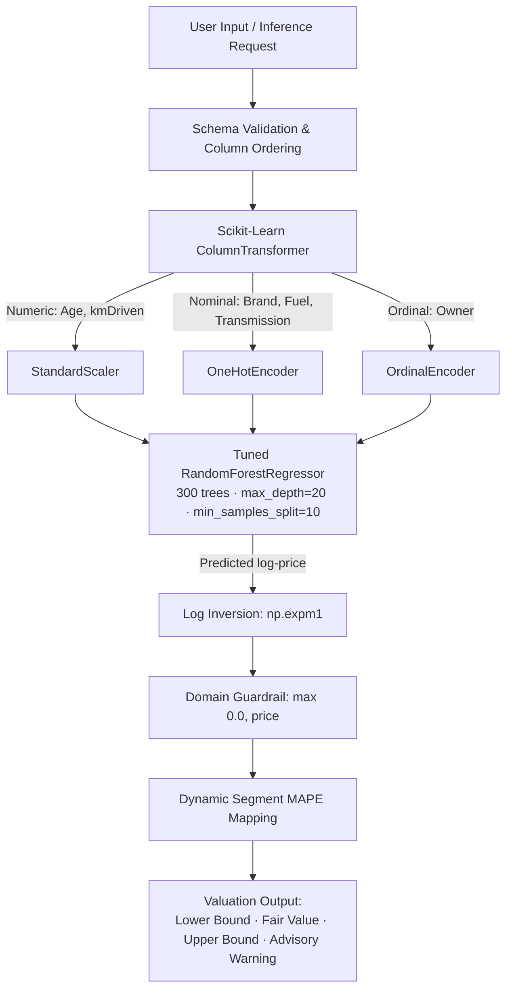

<div align="center">

# Used Car Fair Value Engine

**An end-to-end applied machine learning regression system that estimates pre-owned car market values with segment-calibrated uncertainty bounds.**

[](https://used-cars-fair-value.streamlit.app/)
[](https://www.python.org/)
[](https://scikit-learn.org/)
[](tests/)
[](LICENSE)

[**Launch Live Application**](https://used-cars-fair-value.streamlit.app/) • [**View ML Architecture**](#ml-pipeline--architecture) • [**Model Benchmarks**](#model-evaluation--benchmarks) • [**Local Setup**](#local-setup--reproduction)

</div>

---

## Application Preview

<p align="center">
  
  <br>
  <em>Figure 1: Valuation form with dynamic categorical inputs and real-time validation.</em>
</p>

<p align="center">
  
  <br>
  <em>Figure 2: Fair market value output with conservative/retail bounds, segment alert, and historical market comps.</em>
</p>

<p align="center">
  
  <br>
  <em>Figure 3: Technical engineering scorecard with benchmark progression, brand distribution, and segmented MAPE.</em>
</p>

---

## Problem & System Objective

Pre-owned car pricing suffers from heavy information asymmetry and non-linear depreciation. Standard valuation models typically output a single point estimate (e.g., *"₹6,42,000"*), which obscures real-world pricing volatility. 

Price variance is **heteroscedastic**—budget commuter cars and high-end luxury vehicles exhibit significantly higher percentage error than mid-range vehicles.

**System Objective:** Build a production-grade regression engine that outputs a central fair value estimate flanked by **statistically calibrated confidence intervals** (`Conservative <= Fair Value <= Retail Asking`) tailored to specific market tiers.

---

## Key Highlights

- **Dynamic Uncertainty Bounds:** Replaces arbitrary margins with empirical Mean Absolute Percentage Error (MAPE) stratified across 4 price tiers.
- **Log-Transformed Target:** Fits on `log1p(AskPrice)` to handle right-skewed pricing and stabilize exponential depreciation variance.
- **Grounded Market Comps:** Queries historical data (13,652 listings) to benchmark specific car models against brand medians.
- **Decoupled Architecture:** Clean separation of concerns—UI-agnostic inference engine (`src/pipeline.py`) decoupled from the Streamlit presentation layer (`app/`).
- **Production Contract Testing:** 12 automated unit tests (`pytest`) validating schema contracts, domain invariants, and boundary conditions.
- **Sub-15ms Latency:** Optimized Scikit-learn pipeline serialized via Joblib with `@st.cache_resource` memory reuse.

---

## Dataset & Feature Engineering

Trained on **13,652 cleaned and deduplicated listings** across 39 brands in India (spanning registration years 2000–2024), sourced from the Kaggle Indian Pre-Owned Car Market dataset.

| Feature | Data Type | Encoding / Preprocessing | Description |
| :--- | :--- | :--- | :--- |
| `Age` | Numeric | `StandardScaler` | Vehicle age derived from registration year |
| `kmDriven` | Numeric | `StandardScaler` | Total odometer distance (capped at 300,000 km) |
| `Brand` | Nominal | `OneHotEncoder(handle_unknown='ignore')` | Vehicle manufacturer (39 classes) |
| `FuelType` | Nominal | `OneHotEncoder` | Petrol, Diesel, CNG, LPG, Electric |
| `Transmission` | Nominal | `OneHotEncoder` | Manual, Automatic |
| `Owner` | Ordinal | `OrdinalEncoder` | First, Second, Third, Fourth & Above |
| `AskPrice` | Numeric (Target) | `np.log1p` transformation | Listed vehicle asking price in INR |

---

## ML Pipeline & Architecture



---

## Technical Modeling Decisions

### 1. Log-Transformation of the Target (`log1p`)
Used car prices exhibit strong positive skewness. Fitting standard squared-error loss (MSE) on raw currency values forces the model to prioritize minimizing errors on rare multi-crore luxury cars at the expense of budget commuters. Transforming via `y_trans = log1p(AskPrice)` normalizes target variance and optimizes for relative proportional error across all price points.

### 2. Log-Inversion & Domain Guardrails (`expm1`)
Predictions from the random forest are mapped back to Indian Rupees using:
```text
price_inr = np.expm1(pred_log)
```
An explicit physical guardrail `max(0.0, price_inr)` ensures the pipeline never produces negative valuations when extrapolating on extreme outlier configurations.

### 3. Segmented Error Analysis (MAPE)
Global metrics (R², RMSE) hide regional variance. Segmenting holdout evaluation into 4 price brackets reveals distinct error profiles:

| Tier Bracket | Price Range | Error Margin (MAPE) | Engineering & Market Interpretation |
| :--- | :--- | :---: | :--- |
| **Budget** | < ₹5.0 Lakh | **±37%** | High volatility; physical condition, rust, and service history dictate value. |
| **Mid-Range** | ₹5.0L – ₹15.0L | **±23%** | Core liquidity sweet spot; steady and predictable depreciation. |
| **Premium** | ₹15.0L – ₹30.0L | **±25%** | Moderate spread influenced by brand tier and optional trim equipment. |
| **Luxury** | > ₹30.0 Lakh | **±34%** | Steep depreciation curves and wide variance in high-end packages. |

---

## Model Evaluation & Benchmarks

The model was evaluated on a 20% holdout test set (2,732 listings) using an 80/20 stratified split.

| Model Stage | Test MAE (INR) | Test RMSE (INR) | Test R² | Engineering Notes |
| :--- | :---: | :---: | :---: | :--- |
| **Baseline (Linear Regression)** | ₹3,39,520 | ₹12,44,100 | 0.46 | High bias; unable to capture non-linear brand depreciation curves. |
| **Default Random Forest** | ₹3,14,200 | ₹11,85,400 | 0.52 | Captures feature interactions and non-linear thresholds. |
| **Tuned Random Forest (Selected)** | **₹3,09,522** | **₹11,69,145** | **0.54** | Reduces test MAE by ₹30,000 over baseline; minimizes tree overfitting. |

> **Context on R² = 0.54:** In secondary car markets, asking prices carry significant unobserved variance (paint condition, accident history, tyre wear, local dealer demand). An R² of 0.54 alongside a calibrated ±23% mid-range MAPE represents a strong, realistic model for public listing data without vehicle inspection reports.

---

## Project Structure

```text
used-cars-price-prediction/
├── app/                        # Streamlit presentation layer
│   ├── app.py                  # Entrypoint, navigation, and page router
│   ├── data_loader.py          # Data caching and historical comp queries
│   └── views/                  # Modular UI views (valuation, project, sidebar)
├── data/
│   └── interim/
│       └── used_cars_cleaned.csv # 13,652 cleaned market records for comps (1.6 MB)
├── models/
│   └── rf_tuned_pipeline.joblib  # Serialized 53MB production pipeline artifact
├── src/
│   └── pipeline.py             # Decoupled inference pipeline & business logic
├── tests/
│   ├── __init__.py
│   └── test_pipeline.py        # 12 Pytest unit tests for pipeline contracts
├── requirements.txt            # Production dependencies
└── README.md                   # System documentation
```

---

## Automated Verification & Testing

The inference engine in `src/pipeline.py` is protected by 12 automated unit tests:

```bash
pytest -v tests/
```

- **Pipeline Deserialization:** Ensures the 53MB model loads cleanly and raises `FileNotFoundError` on missing paths.
- **Threshold Boundary Tests:** Validates that exact edge-case boundaries (₹5L, ₹15L, ₹30L) assign correct error margins without off-by-one errors.
- **Invariant Sanity:** Asserts that for all inputs, `0 <= Lower <= Fair Value <= Upper`.
- **Defensive Schema Validation:** Verifies missing or misspelled input columns raise descriptive `ValueError` exceptions.
- **Column Order Invariance:** Guarantees scrambled input features produce identical predictions.

---

## Local Setup & Reproduction

### Prerequisites
- Python 3.10 to 3.13
- Git

### 1. Clone the Repository
```bash
git clone https://github.com/dipjyotisarma-dev/used-cars-price-prediction.git
cd used-cars-price-prediction
```

### 2. Set Up Virtual Environment
```bash
# Windows
python -m venv .venv
.venv\Scripts\activate

# macOS / Linux
python3 -m venv .venv
source .venv/bin/activate
```

### 3. Install Dependencies
```bash
pip install -r requirements.txt
```

### 4. Run Test Suite
```bash
pytest -v tests/
```

### 5. Run Web Application
```bash
streamlit run app/app.py
```
Open `http://localhost:8501` in your browser.

---

## Limitations & Engineering Roadmap

- **Tree Non-Monotonicity:** Tree ensembles can occasionally create non-monotonic splits with respect to mileage. Future work will benchmark gradient boosting (LightGBM / XGBoost) with monotonic constraints.
- **Model Name Cardinality:** Specific vehicle model names were excluded during training due to high cardinality across 13,652 samples. Future iterations will test target encoding or body-type clustering (SUV vs. Sedan vs. Hatchback).
- **Unobserved Inspection Factors:** Online listings lack physical vehicle condition data (paint depth, battery health, tyre tread depth), which defines the natural upper bound of price predictability.

---

## Tech Stack

- **Machine Learning:** Scikit-Learn, NumPy, Pandas, Joblib
- **Frontend & Visualization:** Streamlit
- **Testing & Quality Assurance:** Pytest
- **Cloud Infrastructure:** Streamlit Community Cloud (Headless Linux Container)

---

## License

Distributed under the [MIT License](LICENSE).